# Testing in Xcode: Building Confidence in Your iOS Code

*Part 1 of the iOS Testing Series*

---

You've shipped features, handled edge cases, and navigated Apple's ever-evolving frameworks. You know your way around Xcode. But if you're honest - how much of your codebase do you actually *trust*?

Not "it works on my machine" trust. Real trust. The kind that lets you refactor a networking layer, upgrade a dependency, or hand off a module to a new team member without that creeping anxiety that something, somewhere, is silently breaking.

That's what testing gives you. And Xcode has a surprisingly mature, deeply integrated toolchain to help you build it.

This series is a practical guide to testing iOS applications - from the fundamentals of unit testing to the complexity of UI automation. Whether you've written a few tests and let them rot, or you've avoided testing altogether, this series will help you build a sustainable, meaningful test suite.

---

## The Testing Pyramid in an iOS Context

**Unit tests** are the foundation. They test a single function, class, or piece of logic in isolation - no network, no disk, no UI. Fast to run, easy to debug.

**Integration tests** verify that your components work correctly *together* - a service talking to a repository, a view model reacting to a use case, or a decoder handling real API responses.

**UI tests** drive your app through the simulator like a user would. They're the most expensive to write and maintain, but invaluable for protecting critical user journeys - login, checkout, onboarding.

A healthy iOS project leans heavily on the bottom two layers and uses UI tests selectively.

---

## What Xcode Gives You Out of the Box

Xcode's testing support is built on **XCTest**, Apple's first-party framework, and has grown significantly over the years. Here's a high-level map of what's available:

### XCTest - Unit & Integration Testing
The core framework. You subclass `XCTestCase`, write methods prefixed with `test`, and use `XCTAssert*` functions to verify expectations. It integrates directly with Xcode's test navigator, inline pass/fail indicators, and code coverage reporting.

### Swift Testing - The Modern Alternative
Introduced alongside Swift 5.9, the **Swift Testing** framework (`import Testing`) brings a more expressive, macro-based API. `@Test`, `@Suite`, and `#expect` replace the verbose XCTest conventions. It's not a replacement for XCTest yet — particularly for UI tests - but it's where Apple is investing, and it's worth knowing.

### XCUITest - UI Automation
Built on the Accessibility APIs, `XCUITest` lets you find, interact with, and assert on UI elements programmatically. It runs in a separate process from your app, which keeps tests honest but also makes setup and data control more involved.

### Xcode Test Plans
Test plans (`.xctestplan` files) let you configure how your tests run — which targets to include, what environment variables to set, whether to randomize test order, and how to handle test repetitions for flakiness detection. Invaluable for CI pipelines.

### Code Coverage
Xcode can visualize line-by-line coverage directly in the editor. More useful as a signal than a target - coverage tells you *what you haven't tested*, not whether your tests are meaningful.

---

"The best iOS codebases aren't the ones with the highest coverage numbers. They're the ones where the tests tell a clear story about what the code is supposed to do, and where a failing test means something real has broken",

Ace

---

*Next up: **Unit Testing Fundamentals** - setting up your test target, writing your first XCTestCase, and understanding the assertion model.*

