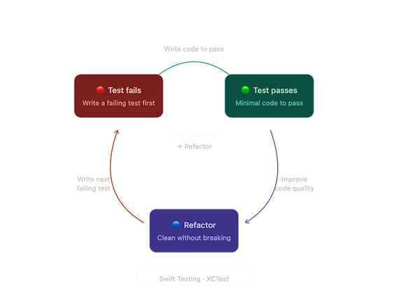
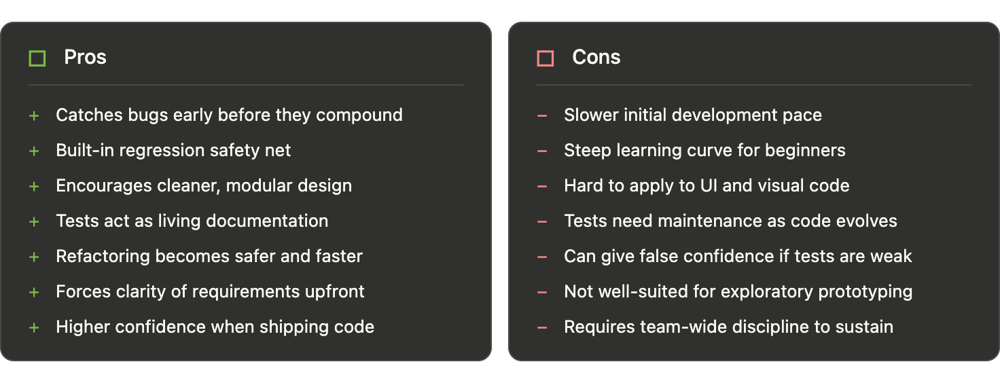

# Test Driven Development - TDD

"A QA engineer walks into a bar. Orders 1 beer. Orders 0 beers. Orders 99999999 beers. Orders -1 beers. Orders a lizard. Orders NULL beers. Orders asdfjkl; beers. The first real customer walks in and asks where the bathroom is. The bar bursts into flames." 

# What is Test Driven Development?

Test-Driven Development (TDD) is a software development methodology where tests are written before the actual implementation code. Rather than building a feature and testing it afterward, the developer begins by writing a failing test that defines the desired behaviour, then writes just enough code to make that test pass, and finally refactors the code to improve its structure and readability - all without breaking the test. This tight loop, known as Red-Green-Refactor, repeats for every small unit of functionality, resulting in a codebase that is continuously verified by automated tests. The discipline of writing tests first forces developers to think clearly about requirements and edge cases upfront, which leads to better-designed, more maintainable code with fewer bugs over time.

# Pro's and Con's of TDD

The cons don't outweigh the pros so much as they highlight where TDD requires discipline and upfront investment. For iOS development specifically, the __"hard to apply to UI" point is worth noting__ - TDD shines most on business logic and networking layers, while UI testing with Swift Testing or XCTest UI requires a different approach.

# How to apply TDD to Visual Code like iOS apps

UI and TDD can coexist, it just requires a shift in strategy. Here are the key approaches:

1. Separate logic from UI (MVVM / MVP)
The single most effective move. Push as much logic as possible out of your views and into ViewModels or Presenters. Your views become thin - they only render state. Then you TDD the ViewModel, not the view itself. In SwiftUI, a @Observable ViewModel with pure input/output functions is very testable.

2. Test view state, not view structure
Rather than testing "does this button appear on screen", test "when the ViewModel is in an error state, does the view model's showError property return true". You're testing the conditions that drive the UI, not the UI rendering itself.

3. Accessibility identifiers as test anchors
For UI tests with XCTest or Swift Testing, assign .accessibilityIdentifier to key elements. This decouples your tests from fragile things like button titles or layout position. Your tests can then assert presence and interaction without caring how the element looks.

4. Component-level testing
Rather than testing entire screens, isolate and test individual SwiftUI views or UIKit components in a PreviewProvider or a lightweight test host. Smaller surface area means faster, more focused tests.

5. Accept a hybrid approach
In practice, most iOS teams apply strict TDD to the logic layer (networking, parsing, business rules, state machines) and use snapshot or UI tests as a looser regression net on the view layer. This is pragmatic, not a compromise - it matches TDD's strengths to where they deliver the most value.

In the next post, we take TDD off the whiteboard and apply it directly to a sample iOS project.

"Code that has never failed a test has never been properly tested." - Anonymous

Ace