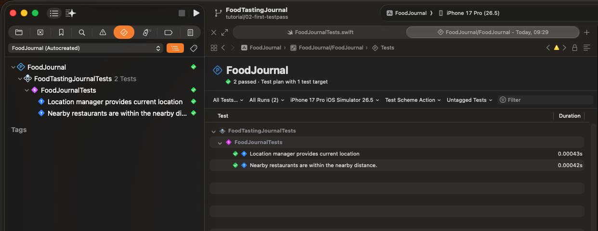

# Applying TDD - First "Test Pass"

We left off with two failing tests staring back at us - red, unsatisfied, waiting. Now comes the fun part. In this post, we put on our "make it work" hat and write just enough code to turn those failures into passes. No elegance, no over-engineering, just the minimum needed to satisfy each test. That's the deal with the Green phase: get to green fast, worry about clean later.

## Sample Repository
Source code project:
* https://github.com/RMIT-Ace/FoodTastingJournal

Branch:
* Tutorial/02-first-testpass

# Green Phase: Making the Tests Pass

With our two failing tests in place from the Red phase, it's time to switch hats. In TDD, the Green phase is about writing the *minimum* code needed to satisfy each requirement — nothing more. Let's work through our two test cases one at a time.

## First Requirement: Track the User's Current Location

```swift
@Test("Location manager provides current location")
```

To satisfy this, we need something that can hold and expose the user's current location. Let's introduce a `LocationManager`:

```swift
import Foundation
import CoreLocation

@Observable
class LocationManager {
    var currentLocation: CLLocation?
}
```

That's enough to update our first test:

```swift
import Testing
import Foundation
import CoreLocation

@testable import FoodTastingJournal

struct FoodJournalTests {
    static let melbLocation = CLLocation(latitude: -37.8136, longitude: 144.9631)

    let locationManager: LocationManager = {
        let manager = LocationManager()
        manager.currentLocation = Self.melbLocation
        return manager
    }()

    @Test("Location manager provides current location")
    func getCurrentLocation() async throws {
        #expect(locationManager.currentLocation == Self.melbLocation)
    }

    ...
}
```

## Second Requirement: Surface Nearby Restaurants

```swift
@Test("Nearby restaurants are within the nearby distance.")
```

This one needs a bit more scaffolding. To satisfy it, `LocationManager` needs to:

1. Hold a list of visited restaurants
2. Calculate the distance from each restaurant to the current location
3. Return only the restaurants within a "nearby" radius (let's say 100 meters, for now)

First, something to represent a restaurant:

```swift
import Foundation
import CoreLocation

struct Restaurant {
    let name: String
    let location: CLLocation
}
```

Now let's extend `LocationManager` to do the filtering:

```swift
class LocationManager {
    var currentLocation: CLLocation?
    var visitedRestaurants: [Restaurant] = []
    var nearByDistance: Double = 100 // meters

    var nearByRestaurants: [Restaurant] {
        guard let currentLocation else { return [] }
        return visitedRestaurants.filter {
            $0.location.distance(from: currentLocation) <= nearByDistance
        }
    }
}
```

Before updating the test, we need some test data. This data has no business living in the app target — it only exists to support our tests — so it goes straight into `FoodJournalTests.swift`:

```swift
struct FoodJournalTests {

    ...

    static let nearRestaurants: [Restaurant] = [
        Restaurant(name: "Restaurant 1",
            location: .init(latitude: -37.8136, longitude: 144.9632)
        ),
        Restaurant(name: "Restaurant 2",
            location: .init(latitude: -37.8137, longitude: 144.9633)
        ),
    ]

    static let farRestaurants: [Restaurant] = [
        Restaurant(name: "Restaurant 3",
            location: .init(latitude: -37.8136, longitude: 144.9742)
        ),
        Restaurant(name: "Restaurant 4",
            location: .init(latitude: -37.8137, longitude: 144.9743)
        ),
    ]

    static let visitedRestaurants: [Restaurant] = {
        nearRestaurants + farRestaurants
    }()

    ...
}
```

With that in place, the second test becomes:

```swift
@Test("Nearby restaurants are within the nearby distance.")
func nearByRestaurantsWithinDistance() throws {
    let currentLocation = try #require(locationManager.currentLocation)

    for restaurant in locationManager.nearByRestaurants {
        let restaurantDistance = restaurant.location.distance(from: currentLocation)
        #expect(restaurantDistance <= locationManager.nearByDistance)
    }
}
```

We're now ready to run both tests. Hit **Cmd+U** and watch them go green. Congratulations — you've just seen your first successful TDD test run.



That's the Green phase wrapped up - two requirements, two passing tests, and just enough code to satisfy each one. Notice we didn't reach for elegance or worry about edge cases; that's deliberate. TDD asks us to defer those concerns until the next step. Now that our tests are green, we're free to revisit the code we just wrote and clean it up without fear of breaking anything - which is exactly what the Refactor phase is for.


"Debugging is twice as hard as writing the code in the first place. So if you write the code as cleverly as possible, you are, by definition, not smart enough to debug it." -- Brian Kernighan

Ace