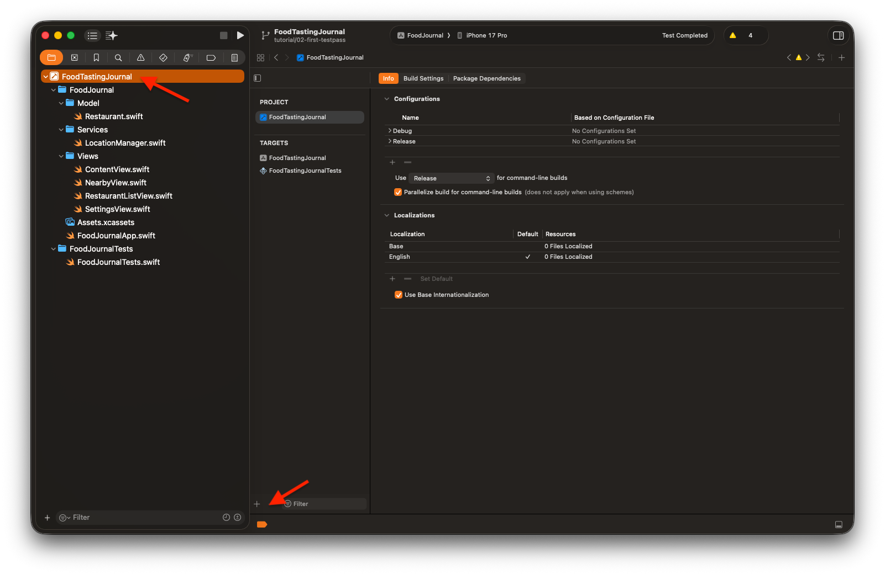
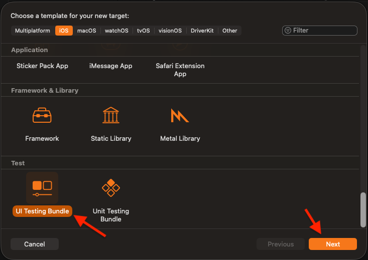
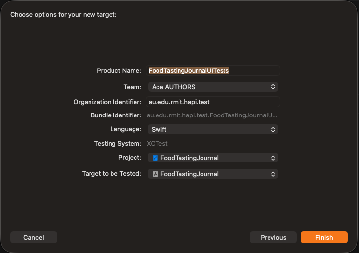
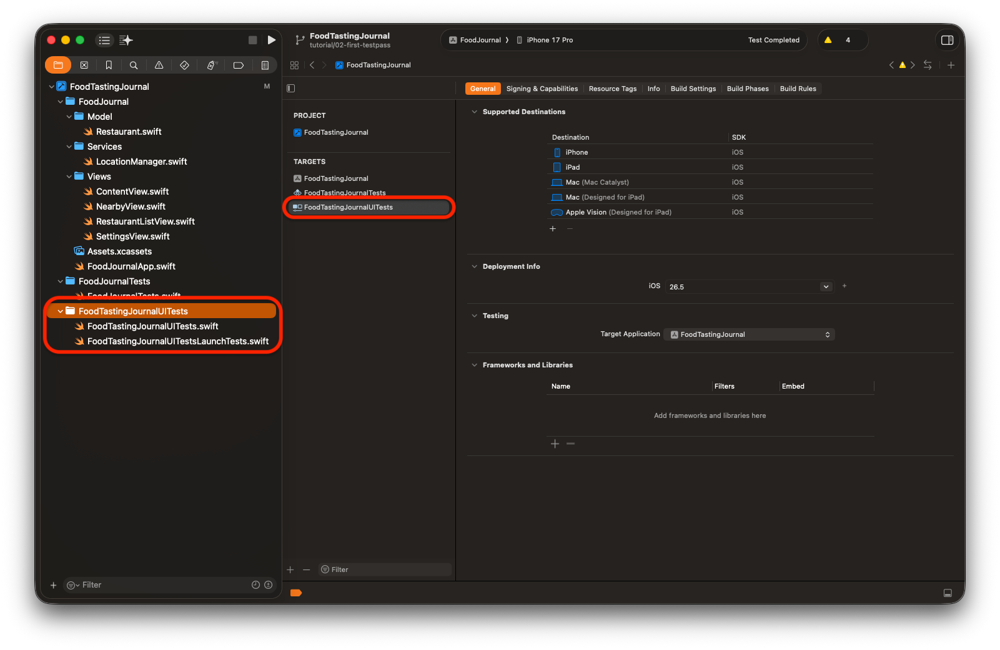

# Applying TDD - UITests


## Repository

Source code project:
* https://github.com/RMIT-Ace/FoodTastingJournal

Branch:
* Tutorial/03-second-testfail
* Tutorial/03-second-testpass


# Introducing XCUITest

UITest (or XCUITest) is Apple's UI testing framework built into Xcode. It lets you write automated tests that interact with your app's interface the same way a user would - tapping buttons, entering text, swiping, etc.

* XCUIApplication - represents your app process. You launch it, terminate it, and query its UI elements through this object.

* XCUIElement - represents a UI element (button, label, text field, etc.). You interact with it via .tap(), .typeText(), .swipeUp(), and so on.

* XCUIElementQuery - used to find elements by type, accessibility identifier, label, or other attributes. Queries are lazy and only resolve when you access an element.

* Accessibility identifiers - the recommended way to identify elements in tests. Set accessibilityIdentifier in your app code so tests can find elements reliably without depending on display text.


# Adding XCUITest Target



Click the project root in the navigator - that's the topmost item labeled FoodTastingJournal with the blue Xcode icon. This opens the project editor on the right, where you can see your project's configurations and targets.

Notice the Targets section lists two entries: the app target (FoodTastingJournal) and a unit test target (FoodTastingJournalTests). There's no UI test target yet - we'll fix that.

To add one, click the + button at the bottom-left of the Targets list (just to the left of the Filter field) to add a new target.



A sheet appears listing all the target templates available for iOS. Scroll down to the Test section and select UI Testing Bundle - this is the template that creates an XCUITest target wired up to drive your app's interface. Once it's selected (you'll see it highlighted), click Next.



Xcode pre-fills most of these fields for you. The key ones to confirm:

Product Name - FoodTastingJournalUITests is fine; this becomes the target and folder name.

Testing System - locked to XCTest, which is what we want.

Target to be Tested - make sure this is set to FoodTastingJournal (your main app target). This tells Xcode which app to launch when the UI tests run.

Everything else (Team, Organization Identifier, Language) can stay as-is. When it all looks good, click Finish and Xcode will add the new UITest target to your project.



To keep things simple, delete 'FoodTastingJournalUITestsLaunchTests.swift' for now.

# Our First XCUITest

## The UI Test - Red Phase
This is the test file Xcode generated for our new UI Testing Bundle target. The boilerplate gives us two lifecycle methods:

`setUpWithError()` runs before each test. Setting continueAfterFailure = false means if one assertion fails, the test stops immediately rather than plowing through the rest.

`tearDownWithError()` runs after each test — we'll leave it empty for now.

The test itself is `testLaunchShowsNearbyView`. Following TDD, we write this before touching the app code - so right now, it's expected to fail.

The test launches the app, then looks for a UI element with the accessibility identifier "NearbyView". waitForExistence(timeout: 5) gives the app up to five seconds to show it before giving up - useful for any async work that happens at launch.

If the element isn't found within that window, XCTAssertTrue fails with a descriptive message telling us exactly what's missing.

Run it now and it will fail - that's the point. The red test is our contract: it tells us precisely what we need to build. In the next step, we'll go into NearbyView and add the `.accessibilityIdentifier("NearbyView")` modifier to make it pass.

```swift
import XCTest

final class FoodTastingJournalUITests: XCTestCase {

    override func setUpWithError() throws {
        continueAfterFailure = false
    }

    override func tearDownWithError() throws {
    }

    @MainActor
    func testLaunchShowsNearbyView() throws {
        let app = XCUIApplication()
        app.launch()

        let nearbyViewMarker = app.otherElements["NearbyView"]

        // Allow a short wait for the initial view to appear.
        let exists = nearbyViewMarker.waitForExistence(timeout: 5)
        XCTAssertTrue(exists, "Expected to find NearbyView on launch, but it was not present. Make sure an element in NearbyView has accessibilityIdentifier 'NearbyView'.")
    }
}
```

## The UI Test - Green Phase

```swift
struct ContentView: View {
    var body: some View {
        TabView {
            NearbyView()
                .accessibilityIdentifier("NearbyView")      // << -- For UI Test 
                .tabItem { ... }

            RestaurantListView()
                .tabItem { ...  }

            SettingsView()
                .tabItem { ...  }
        }
    }
}
```

The change is minimal, which is exactly what TDD asks for: do the least amount of work needed to make the test pass.

The single addition is .accessibilityIdentifier("NearbyView") attached to the NearbyView() instance. This stamps an identifier onto the view's accessibility tree, giving XCUITest a reliable handle to query against. No logic changed, no layout changed - just a label the test can see.

Run the tests again and testLaunchShowsNearbyView goes green. The app launches, NearbyView is the first thing on screen, and waitForExistence finds the marker well within its five-second window.

Notice we didn't add the identifier to RestaurantListView or SettingsView - only NearbyView needs it because that's all the test required. We add identifiers as tests demand them, not speculatively.