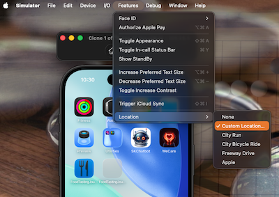

# TDD UI Test (Continue)


## Repository

Source code project:
* https://github.com/RMIT-Ace/FoodTastingJournal

Branch:
* Tutorial/06-TDD-iteration-4

# More Map & Location Testing

Naturally, the next useful feature we would liek to test will be that our app drop a pin marking current location of the user.

This we can express in XCTest language as follow.

```swift
@MainActor
    func testNearbyMapShowsCurrentLocationPin() throws {
        let app = XCUIApplication()
        app.launch()

        // The pin must be inside the map.
        let mapMarker = app.descendants(matching: .any)["NearbyMap"].firstMatch
        XCTAssertTrue(mapMarker.waitForExistence(timeout: 5), "Expected to find the map in NearbyView before checking for the pin.")

        // Look for the current-location pin by its accessibility identifier.
        let currentLocationPin = mapMarker.descendants(matching: .any)["CurrentLocationPin"].firstMatch

        // Allow a short wait for the pin to appear on the map.
        let exists = currentLocationPin.waitForExistence(timeout: 10)
        XCTAssertTrue(exists, "Expected to find a pin for the current location on the map, but it was not present. Make sure the current-location annotation has accessibilityIdentifier 'CurrentLocationPin'.")
    }
```

Run the test, and of course, our test fails.

# Implementing Changes to Satisfy the Test

## Location Manager

First we need an ability to detect and update current location. We will use `liveUpdates()` of `CLLocationUpdate` from CoreLocation framework.

```swift
// File: LocationManager.swift

func startUpdatingCurrentLocation() async {
        do {
            // Start continuous updating of location.
            for try await update in CLLocationUpdate.liveUpdates() {
                if let location = update.location {
                    currentLocation = location
                } else if update.authorizationDenied {
                    print(">> WARNING: Location access denied")
                    break
                }
            }
        } catch {
            print(">> WARNING: Location updates failed: \(error.localizedDescription)")
        }
    }
```

## Create LocationManager Instant 

Next we need to create an instant of our Location Manager and make it available throughout our app. Our main `FoodJournalApp` is updated as follow:

```swift
import SwiftUI

@main
struct FoodJournalApp: App {
    
    let locationManager: LocationManager
    
    init() {
        locationManager = LocationManager()
    }
    
    var body: some Scene {
        WindowGroup {
            ContentView()
        }
        .environment(locationManager)
    }
    
}
```

## Update NearbyView

First off we need to access to the LocationManager. We also need to pan our map into the user's current position.

```swift
struct NearbyView: View {
    @Environment(LocationManager.self) private var locationManager
    @State private var cameraPosition: MapCameraPosition = .automatic
    ...
}
```

With MapKit, we can use `Annotation` to mark the user's current location on the map.

```swift
            Map(position: $cameraPosition) {
                if let currentLocation = locationManager.currentLocation {
                    Annotation("Current Location", coordinate: currentLocation.coordinate) {
                        Image(systemName: "mappin.circle.fill")
                            .font(.title)
                            .foregroundStyle(.red)
                            .accessibilityIdentifier("CurrentLocationPin")
                    }
                }
            }
            .accessibilityIdentifier("NearbyMap")
            .navigationTitle("Nearby")
```

Now we want to update `currentLocation` when this view is presented.

```swift
            Map(position: $cameraPosition) {
                if let currentLocation = locationManager.currentLocation { ...  }
            }
            .accessibilityIdentifier("NearbyMap")
            .navigationTitle("Nearby")
            .task {
                await locationManager.startUpdatingCurrentLocation()
            }
```

Location manager will continuously feeding the updated location. We want to also update and bring this location into the visible area.

```swift
            Map(position: $cameraPosition) { ...  }
            .accessibilityIdentifier("NearbyMap")
            .navigationTitle("Nearby")
            .task { ...  }
            .onChange(of: locationManager.currentLocation, initial: true) {
                guard let currentLocation = locationManager.currentLocation else { return }
                setCameraPosition(to: currentLocation)
            }
```

## Preparing Simulator for Map & Location Testing

Hence, we will be do our tests on the simulators. We need to simulate the user's current position.



You can specify the custom location for testing by clicking on Simulator app: Features > Location > Custom Location ...


# Test all you Test Cases

Test all your test cases. They all should be pass.
